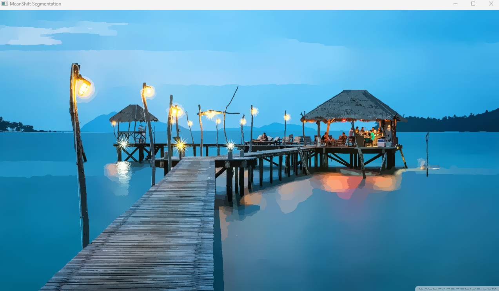

# Mean Shift Segmentation

This project implements the mean shift segmentation algorithm using a gaussian kernel. The project uses OpenGL shaders for parallel computing to achive realtime performance


## Mean Shift Algorithm
Mean Shift is a non-parametric clustering algorithm that identifies dense regions in data by iteratively shifting points toward the mode (peak) of their local density. For images, it smooths/blurs pixels while preserving edges by averaging neighboring pixels weighted by color similarity and spatial proximity. Key steps:

- Kernel: Define a window (radius) around each pixel.

- Weighting: Compute weights based on color/spatial distance.

- Shift: Move the window center to the weighted mean of neighbors.

- Repeat: Until convergence (no significant movement).
In image processing, it’s used for tasks like denoising, segmentation, and creating painterly effects.

for better understanding of the mean shift algorithm please follow this great article by Bingyang [Mean Shift Segmentation](https://bbbbyang.github.io/2018/03/19/Mean-Shift-Segmentation/)


## How to run

To run this project on your computer you need to have CMake Installed. Once you installed cmake just run this command

```bash
  git clone https://github.com/alithegreat74/MeanShift-Segmentation-opengl.git --recursive
  cd MeanShift-Segmentation-opengl
  mkdir build
  cd build
  cmake ..
```


## Screenshot

This is how it looks like before segmentation


This is how it looks like with a 6*6 kernel and a max iteration of 5




## Thirdparty Libraries

- [GLFW](https://github.com/glfw/glfw) for creating a context window to render in
- [GLAD](https://glad.dav1d.de/) for loading modern opengl functions
- [ImGUI](https://github.com/ocornut/imgui) for creating reacting debug window
- [stb_image](https://github.com/nothings/stb/blob/master/stb_image.h) for loading textures


## How it Works

The way this project implements the MeanShift Algorithm is

- Create opengl context
- Create two framebuffers(we call them ping pong framebuffers)
- Load The input texture
- Create two texture with the same width and height as the input texture(we call them ping pong textures)
- render the basic input texture to the first framebuffer using a basic texture renderer shader
- Render the scene with the mean shift shader and go back and fourth with the ping pong shaders and texture n number of times
- render the output shader with the normal texture show shader 
